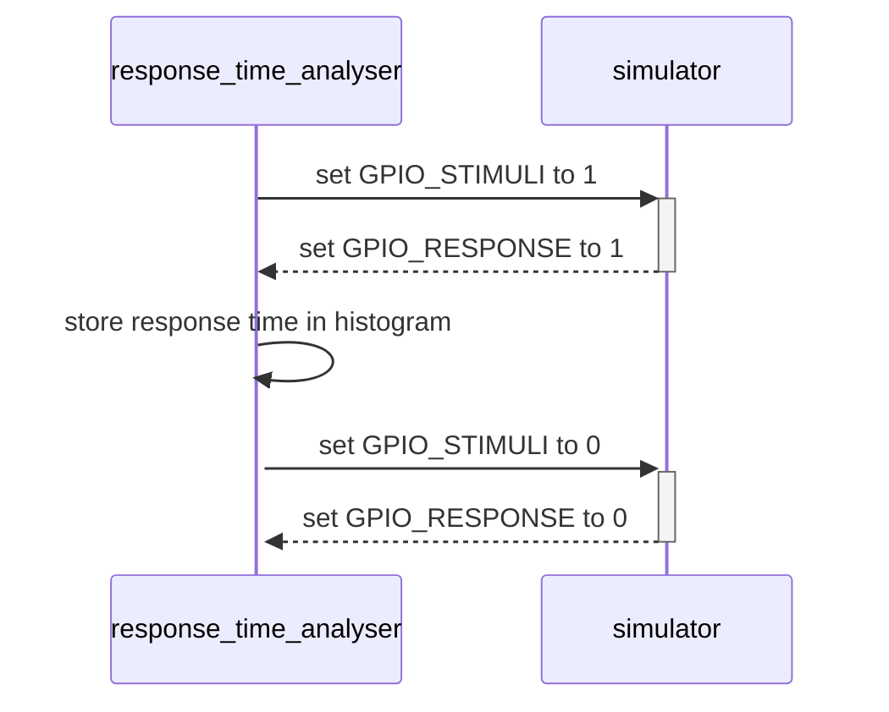
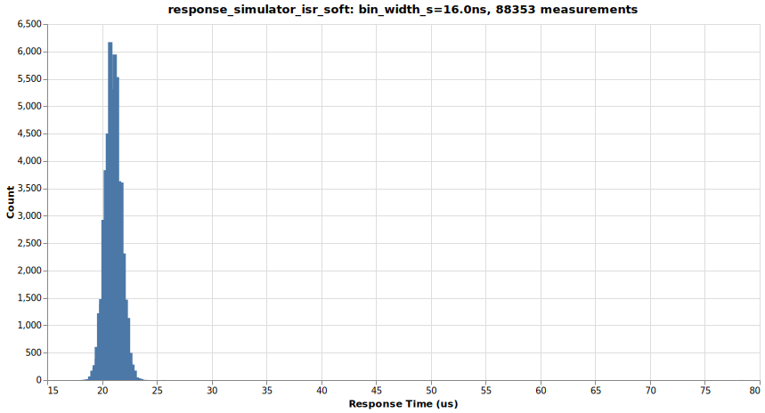
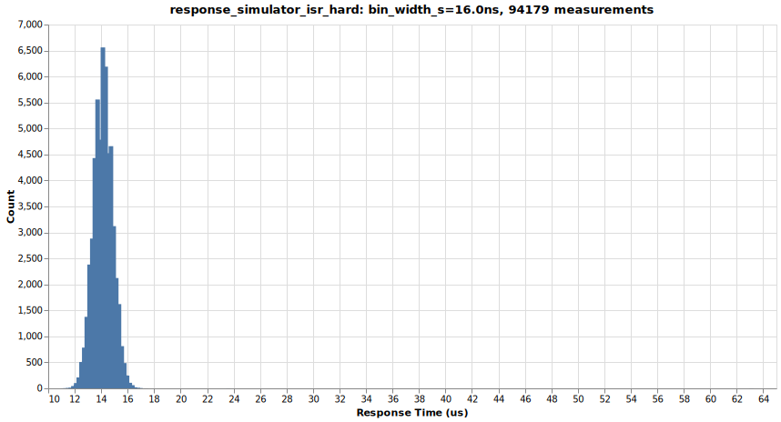
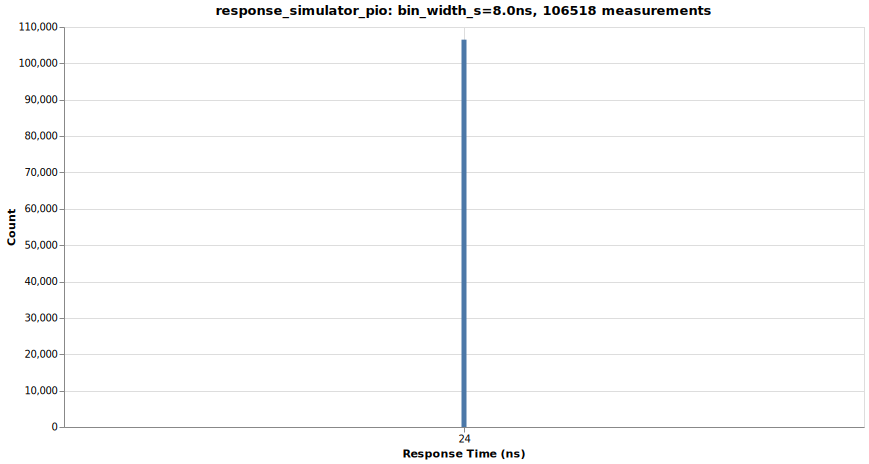

# response_time_analyzer

Response Time Analyzer in MicroPython

See also [agent.md](agent.md)

## How to measure the response time

## Wiring

| Name | pico response_time_analyzer | pico simulator |
| - | - | - |
| GND | pin 3 | pin 3 |
| GPIO_STIMULI | pin1/GP0/out | pin1/GP0/in |
| GPIO_RESPONSE | pin2/GP1/in | pin2/GP1/out |

[Pico Pinout](https://www.raspberrypi.com/documentation/microcontrollers/images/pico-pinout.svg),
[Pico2 Pinout](https://www.raspberrypi.com/documentation/microcontrollers/images/pico-2-r4-pinout.svg)

## Response time test results

### MicroPython interrupt service routine 'soft'

[Dataset](testresults/response_simulator_isr_soft.txt),
[Source](response_simulator_isr_soft.py)

The response time is typically 24 us, but may be up to 85 us (garbage collector?).

### MicroPython interrupt service routine 'hard'

[Dataset](testresults/response_simulator_isr_hard.txt),
[Source](response_simulator_isr_hard.py)

The response time is typically 16 us, but may be up to 70 us (garbage collector?).

### MicroPython PIO

[Dataset](testresults/response_simulator_pio.txt),
[Source](response_simulator_pio.py)

The response time is always 24ns. This is hard real time!